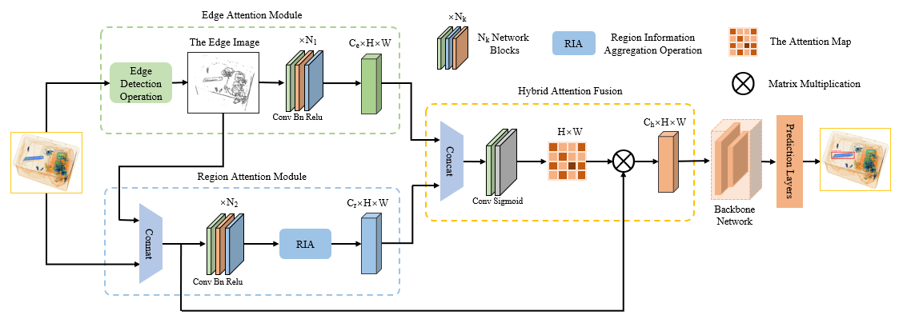
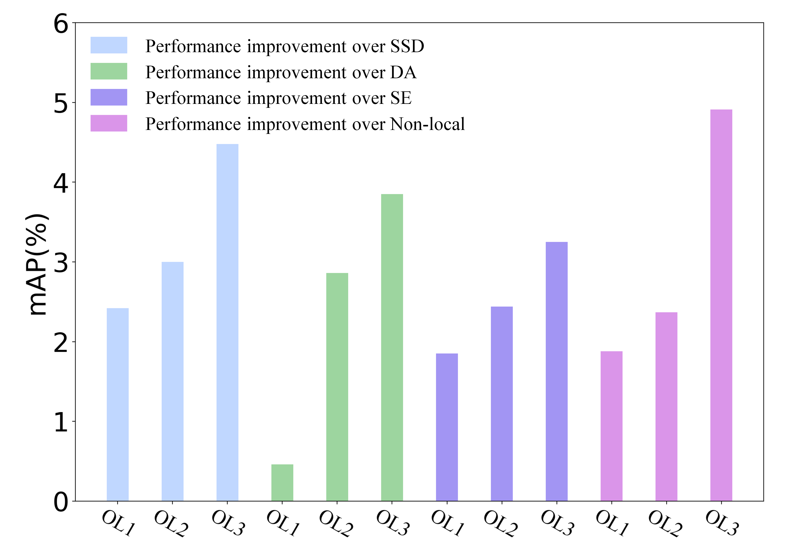
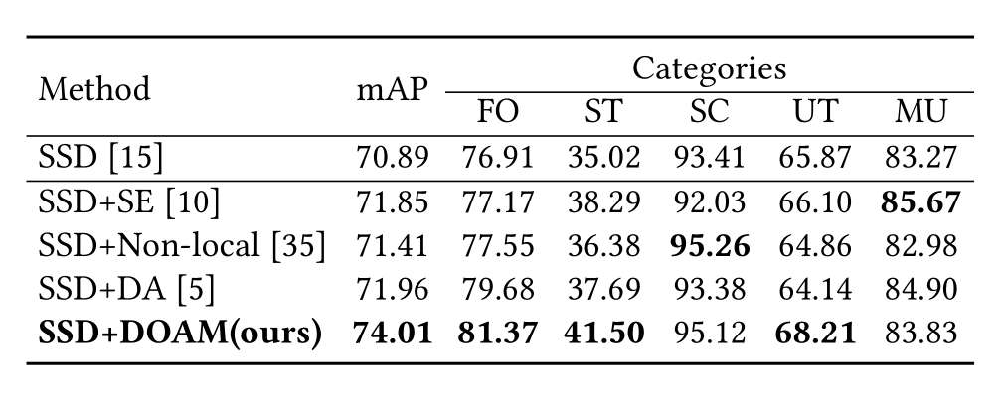

# Occluded Prohibited Items Detection: An X-ray Security Inspection Benchmark and De-occlusion Attention Module

This repository is the official implementation of **De-occlusion Attention Module(DOAM)** and **OPIXray dataset**.

#### DOAM framework:



#### OPIXray dataset:


[](LICENSE)
[](https://github.com/RichardLitt/standard-readme)

## Table of Contents

- [Background](#background)
- [Dataset](#dataset)
- [Install](#install)
- [Usage](#usage)
- [Results](#results)
- [Contributing](#contributing)
- [Acknowledgement](#Acknowledgement)  
- [License](#license)

## Background

In this project, we investigate occluded prohibited items detection in X-ray scanned images, which is a promising application in industry yet remains fewer studied in computer vision. To facilitate research in this field, we present OPIXray dataset, a dataset mainly focusing on occlusion of the objects in the images. All the backgrounds of which were captured from the real-world scenarios and the prohibited items were inserted by the security inspectors we hired from an International Airport, which make the OPIXray dataset cover complicated scenarios and professional. We manually localize the box-level annotations in the images with a bounding box according to the statement provided by these professional security inspectors.

Motivated by filtering irrelevant information, we present a hybrid attention mechanism named DOAM, which can be applied to various popular detection approaches, to refine the features. In practice, we design two attention sub-modules, EAM and RAM, focusing on the information interested respectively. As shown in experiments, DOAM surpasses popular attention mechanisms and the DOAM-integrated network surpasses popular detection approaches obviously, establishing a strong baseline for the proposed task.

## Dataset

In this project, we build the first dataset specially designed for occluded prohibited items detection in security inspection.

<div align=center>
    
</div>

- All images of OPIXray dataset are scanned by security inspection machine and annotated manually by professional inspectors from an international airport, and the standard of annotating is based on the standard of training security inspectors.

- OPIXray dataset contains a total of 8885 X-ray images(7019 for training, 1776 for testing), including 5 categories of cutters, namely, Folding Knife, Straight Knife, Scissor, Utility Knife, Multi-tool Knife. 

	<div align=center>
	    
	</div>

- In order to study the impact brought by object occlusion levels, we divide the testing set into three subsets and name them Occlusion Level 1 (OL1), Occlusion Level 2 (OL2) and Occlusion Level 3 (OL3), where the number indicates occlusion level of prohibited items in images.

	<div align=center>
	    
	</div>

## Install

1. Install pytorch

	The code is tested on python3.5 and pytorch1.3.1

2. Clone the repository

	```
	git clone https://github.com/OPIXray-author/OPIXray.git
	```

3. Access OPIXray dataset

	OPIXray dataset is available only for ACADEMIC PURPOSE, if you are interested in our dataset, feel free to contact rstao@buaa.edu.cn.

## Usage

#### Training

1. Change root to `DOAM`

    ```
    cd DOAM
    ```

2. Modify `OPIXray_ROOT` in `data/OPIXray.py` :

    ```
    OPIXray_ROOT = 'OPIXray_Dataset/train/'	# path to trainset of OPIXray Dataset
    ```

3. run `train.py`

    ```
    python train.py --image_sets 'OPIXray_Dataset/train/train_knife.txt' --transfer './weights/ssd300_mAP_77.43_v2.pth' --save_folder './checkpoints'
    ```

    - `--save_folder`: the path to save the checkpoint while training.
    - `--dataset_root`: the path to the training dataset.
    - `--image_sets`: the path to a TXT file that saves all the picture names used for training.
    - `--transfer`: indicates the path to SSD pre-trained weight(available at [here](https://s3.amazonaws.com/amdegroot-models/ssd300_mAP_77.43_v2.pth)).

#### Testing

1. Change root to `DOAM`

    ```
    cd DOAM
    ```

2. Modify `OPIXray_ROOT` in `data/OPIXray.py` :

    ```
    OPIXray_ROOT = "OPIXray_Dataset/test/"	# path to testset of OPIXray Dataset
    ```
    
3. run `test.py`

    ```
    python test.py --imagesetfile 'OPIXray_Dataset/test/test_knife.txt' --trained_model './weights/DOAM.pth' 
    ```
    
    - `--imagesetfile`: the path to a TXT file that saves all the picture names used for testing.
    	- `test_knife.txt`: total testset
    	- `test_knife-1.txt`: occlusion level 1 (no or slight occlusion).
    	- `test_knife-2.txt`: occlusion level 2 (partial occlusion).
    	- `test_knife-3.txt`: occlusion level 3 (severe or full occlusion).
    - `--trained_model`: the checkpoint you want to evaluate, and our trained model is available at [here](https://pan.baidu.com/s/1OXvFODNcha2b3Jq5F6qkpw) (password: m9zk).

## Results
The performance of SSD and YOLOv3 under three different object occlusion levels:

<div align=center>
    
</div>

The amount changes of performance improvement of DOAM with occlusion level increases:

<div align=center>
    
</div>

Performance comparison between DOAM-integrated network and baselines for three famous detection approaches:

<div align=center>
    
</div>

## Contributing


## Acknowledgement

Thank [amdegroot/ssd.pytorch](https://github.com/amdegroot/ssd.pytorch) for the SSD backbone on which our DOAM based.

## License

The images and the corresponding annotations in OPIXray Dataset can be used **ONLY for academic purposes**, **NOT for commercial purposes**. 

Copyright © 2020 by State Key Lab of Software Development Environment, Beihang University

All rights reserved.
