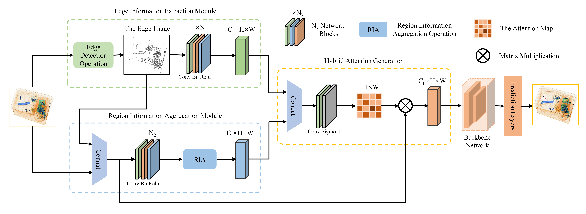
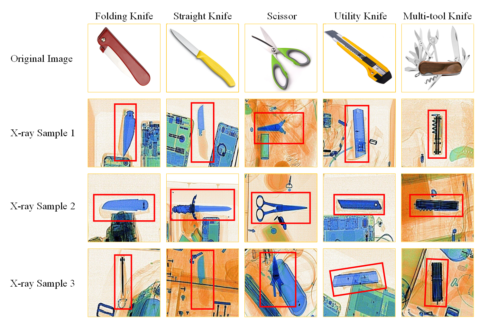
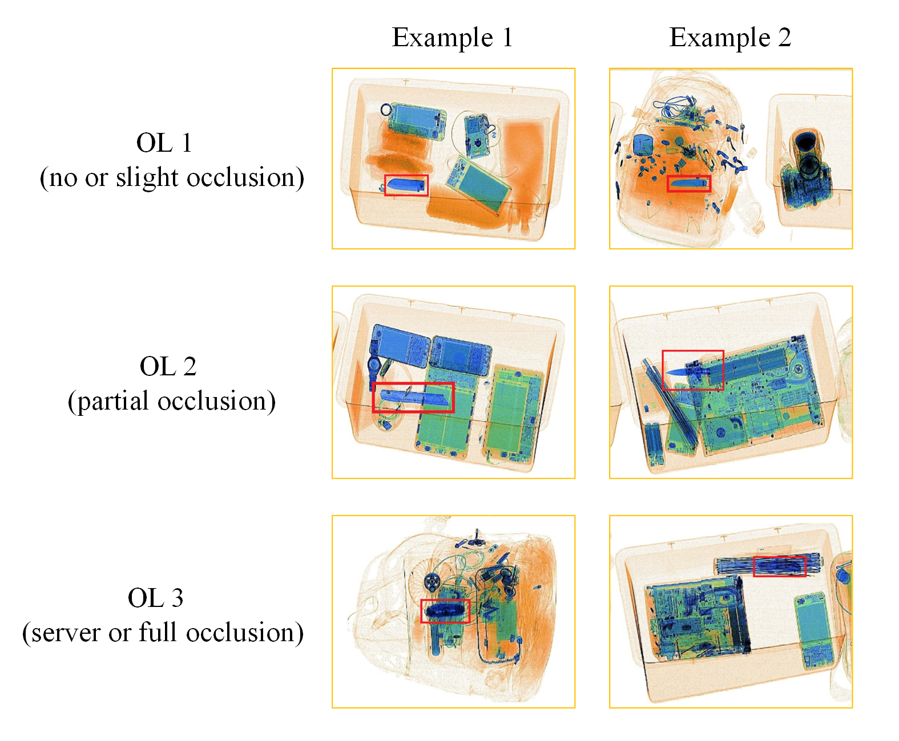
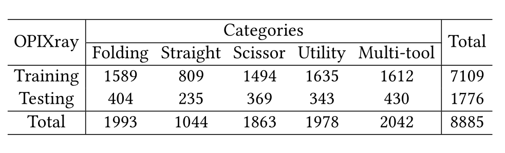
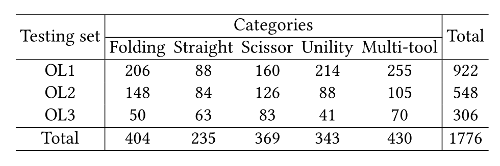

# [Occluded Prohibited Items Detection: An X-ray Security Inspection Benchmark and De-occlusion Attention Module](https://arxiv.org/abs/2004.08656)

This repository is the official implementation of **De-occlusion Attention Module(DOAM)** and **OPIXray dataset**. Paper link: https://arxiv.org/abs/2004.08656.

#### DOAM framework:

#### OPIXray dataset:

    

## Table of Contents

- [Overview](#overview)
- [Dataset](#dataset)
- [Install](#install)
- [Usage](#usage)
- [Results](#results)
- [Contributing](#contributing)
- [Acknowledgement](#Acknowledgement)  
- [License](#license)

## Overview

Security inspection often deals with a piece of baggage or suitcase where objects are heavily overlapped with each other, resulting in an unsatisfactory performance for prohibited items detection in X-ray images. 

In this work, first, we contribute a high-quality dataset named OPIXray, each of which is annotated manually by professional inspectors from an international airport. To the best of our knowledge, this is the first dataset specifically designed for object detection in security inspection. Second, we propose a De-occlusion Attention Module (DOAM) that can be inserted as a plug-and-play module into most detectors, aiming at detecting occluded prohibited items in X-ray images. Finally, we evaluate our method on the OPIXray dataset and compare it to several baselines, including popular methods for detection and attention mechanisms. As is shown from the results, our proposed method significantly outperforms existing models. 

## Dataset

In this project, we build the first dataset specially designed for occluded prohibited items detection in security inspection.

    

- All images of OPIXray dataset are scanned by security inspection machine and annotated manually by professional inspectors from an international airport, and the standard of annotating is based on the standard of training security inspectors.

- OPIXray dataset contains a total of 8885 X-ray images(7019 for training, 1776 for testing), including 5 categories of cutters, namely, Folding Knife, Straight Knife, Scissor, Utility Knife, Multi-tool Knife. 

	

	    
	

- In order to study the impact brought by object occlusion levels, we divide the testing set into three subsets and name them Occlusion Level 1 (OL1), Occlusion Level 2 (OL2) and Occlusion Level 3 (OL3), where the number indicates occlusion level of prohibited items in images.

	

	    
	

- The information structure of annotation file is as follows: 
	image name, category, top-left position of prohibited item (x1, y1), bottom-right position of prohibited item (x2, y2).

## Install

1. Access OPIXray dataset

	OPIXray dataset is available only for ACADEMIC PURPOSE, if you are interested in our dataset, feel free to contact rstao@buaa.edu.cn.

## License

The images and the corresponding annotations in OPIXray Dataset can be used **ONLY for academic purposes**, **NOT for commercial purposes**. 

Copyright © 2020 by State Key Lab of Software Development Environment, Beihang University

All rights reserved.
