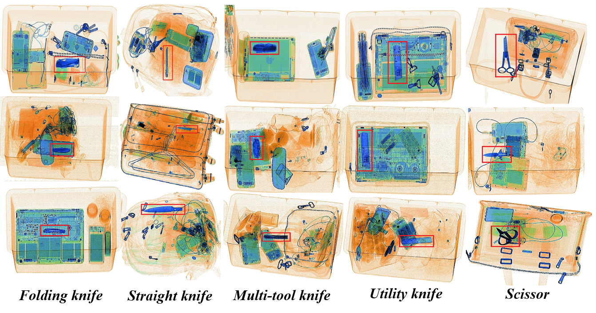

# Occluded Prohibited Items Detection: An X-ray Security Inspection Benchmark and De-occlusion Attention Module

This repository is the official implementation of **De-occlusion Attention Module(DOAM)** and **OPIXray dataset**.

#### DOAM framework:


#### OPIXray dataset:



[](LICENSE)
[](https://github.com/RichardLitt/standard-readme)

## Table of Contents

- [Security](#security)
- [Background](#background)
- [Install](#install)
- [Usage](#usage)
- [API](#api)
- [Contributing](#contributing)
- [Acknowledgement](#Acknowledgement)  
- [License](#license)

## Security


## Background

In this project, we investigate occluded prohibited items detection in X-ray scanned images, which is a promising application in industry yet remains fewer studied in computer vision. To facilitate research in this field, we present OPIXray dataset, a dataset mainly focusing on occlusion of the objects in the images. All the backgrounds of which were captured from the real-world scenarios and the prohibited items were inserted by the security inspectors we hired from Beijing Capital International Airport, which make the OPIXray dataset cover complicated scenarios and professional. We manually localize the box-level annotations in the images with a bounding box according to the statement provided by these professional security inspectors.

Motivated by filtering irrelevant information, we present a hybrid attention mechanism named DOAM, which can be applied to various popular detection approaches, to refine the features. In practice, we design two attention sub-modules, EAM and RAM, focusing on the information interested respectively. As shown in experiments, DOAM surpasses popular attention mechanisms and the DOAM-integrated network surpasses popular detection approaches obviously, establishing a strong baseline for the proposed task.

## Install

1. Install pytorch

	The code is tested on python3.5 and pytorch1.3.1

2. Clone the repository

	```
	git clone https://github.com/OPIXray-author/OPIXray.git
	```

3. Download OPIXray dataset

	OPIXray dataset is available at [here](https://pan.baidu.com/s/1vhaW_dRSim-3Yu_vKGLqjQ) (password: rntm).

## Usage

#### Training

```
cd DOAM
python train.py --dataset_root='../dataset/OPIXray_Dataset/train/' --image_sets 'train_knife.txt' --transfer './weights/ssd300_mAP_77.43_v2.pth' --save_folder './checkpoints'
```

- `--save_folder`: the path to save the checkpoint while training.
- `--dataset_root`: the path to the training dataset.
- `--image_sets`: the path to a TXT file that saves all the picture names used for training.
- `--transfer`: indicates the path to SSD pre-trained weight(available at [here](https://s3.amazonaws.com/amdegroot-models/ssd300_mAP_77.43_v2.pth)).

#### Testing

```
cd DOAM
python test.py --dataset_root='../dataset/OPIXray_Dataset/test/' --image_sets 'test_knife.txt' --trained_model './weights/DOAM.pth' 
```

- `--trained_model`: the checkpoint you want to evaluate, and our trained model is available at [here](https://pan.baidu.com/s/1OXvFODNcha2b3Jq5F6qkpw) (password: m9zk).

#### Testing on different occlusion levels

```
cd DOAM
python test.py --dataset_root='../dataset/OPIXray_Dataset/test/' --image_sets 'test_knife-1.txt' --trained_model './weights/DOAM.pth' 
```

- `test_knife-1.txt`: occlusion level 1 (no or slight occlusion).
- `test_knife-2.txt`: occlusion level 2 (partial occlusion).
- `test_knife-3.txt`: occlusion level 3 (severe or full occlusion).

## API


## More optional sections


## Contributing

See [the contributing file](CONTRIBUTING.md)!

PRs accepted.

Small note: If editing the Readme, please conform to the [standard-readme](https://github.com/RichardLitt/standard-readme) specification.

## Acknowledgement

In this project, we implemented DOAM on PyTorch based on [amdegroot/ssd.pytorch](https://github.com/amdegroot/ssd.pytorch).

## License

[MIT © Richard McRichface.](../LICENSE)
